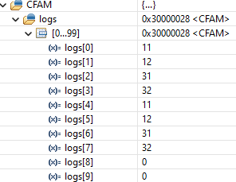

# Interruption Attack on Control Flow Attestestation Mechanism

This repository presents an example of attack on control flow attestation mechanisms under a system that present interruptions and exceptions enabled. The system used in this work was tested in an Arm-v8 Cortex-M33 CPU on a  NUCLEO-L552ZE-Q board.


## Attack Overview

Control flow attestation mechanisms are proposed to generate a proof of control flow integrity to a remote verifier. This proof must be unforgeable by any attacker, meaning that the execution of any illegal control flow must be detectable by using the proof. The proof of integrity in all the current control flow attestation mechanisms are based on logs generated during the execution of each control flow node of the application. A valid control flow path would generate a sequence of logs that is verifiable in the proof, making able for a remote verifier to check the control flow of the application. 

The definition of control flow graph node in the case of CFA is any sequence of non branching instruction that is followed one branching instruction. By this definition, if the execution of the program is atomic, each node is only able to jump instruction when executing the last instruction, the other instructions of the node will be executed sequentially guaranteed. 

CFA mechanisms based on Trusted Executed Environment generally instrument the code to generate logs during the execution of each node the control flow. Different mechanisms generates different types of log, e.g. some methods use hashes to give unique identifiers to the node, others instrument the code to log the address that the jumping instruction is jumping. In this example we consider that each node is instrumented to generate two logs, one before the first instruction and another before the branching instruction. This will generate a generic and undeniable proof that all the instructions of the node were executed or not for atomic execution of the instructions. Also, in this example, we don't care about what is the type of log generated by the CFA mechanism since it will not interfere with the attack .The Figure bellow is an illustration of control flow graph node.


The problem of assuming atomicity on execution is that it implies on deactivating asynchronous exception, e.g. interruptions, from the application . CFA methods are mainly proposed to work on low end embedded devices, and these kind of devices mostly relies on interruptions to provide low energy consumption and real-time control. Removing interruption make most of embedded applications inefficient and  even unfeasible in some cases. On the other side, enabling interruptions breaks the assumption of atomic execution and make it possible for an attacker to execute illegal control flow while generating a valid proof the integrity of the control flow.

This repository present one simple example of attack that can happen during the execution of a control flow attestation mechanism in a system with interruption enable. In this example we consider a code where the control flow graph has 3 main nodes in the MCU loops. Node 1 and Node 3 represents nodes that executes every iteration(we use "for" to simulate execution of random instructions, but in reallity they are supposed to not have any branching instruction inside). Each of the Nodes generates two logs in the format XY, where X in the number of the node and Y can be 1 (enter the node) and 2(leave the node).

```
 // Node 1
 SECURE_Log_Attestation(11);
 for (int i = 0 ; i < 100; i++){}
 SECURE_Log_Attestation(12);

 ...

 // Node 3
 SECURE_Log_Attestation(11);
 for (int i = 0 ; i < 100; i++){}
 SECURE_Log_Attestation(12);
```

Node 2 represents a priviledged node that can only be accessed by changing the variable tAuth to 1. In our sample, tAuth is never changed, so the application is not supposed to run this node.

```
// Node 2
if(tAuth){
    SECURE_CFA_LOG(21);
    priviledgeflag = True;
    SECURE_CFA_LOG(22);
}
```

In figure bellow, the left image illustrates the expected control flow graph of the example, while the right image illustrates the presented attack.


## How to reproduce the attack

Bellow is the description of the steps needed to reproduce the code in this repository:

1. Download STM32CubeProgrammer 1.9.0 v2.10.0
2. Connect NUCLEO-L552ZE-Q using the usb port.
3. Open STM32CubeProgrammer:
    *   Connect with the NUCLEO-L552ZE-Q
    *   Go to user configuration and set "TZEN" and "DBANK" variables
    *   Go to the security areas and set as bellow


4. Download STM32CubeIDE 1.9.0
    
5. Create and configure a new project using the file Sample/Sample.ioc
    
    * File -> New -> STM32 Project Using existing STM32CubeMX COnfiguration file (.ioc)
    * A warning popup will appear when starting the project, click on Yes to generate the code. 
    * Add/Replace the following files of the project with the equivalent files of this repo :
        
        1. {Project_Name}_NonSecure/Core/Src/main.c
        2. {Project_Name}_NonSecure/Core/Src/attack.c
        3. {Project_Name}_NonSecure/Core/Src/stm32l5xx_it.c
        4. {Project_Name}_NonSecure/Core/Inc/attack.h
        5. {Project_Name}_NonSecure/Core/Inc/stm32l5xx_it.h
        6. Secure_nsclib/secure_nsc.h
        7. {Project_Name}_Secure/Core/Src/secure_nsc.c
        8. {Project_Name}_Secure/Core/Src/CFA.c
        9. {Project_Name}_Secure/Core/Inc/CFA.h

    * Open the file NonSecure/Core/Src/attack.c and add breakpoints on the lines that have the following comment : "// Breakpoint"
    * In the project explorer tab, right click on {Project_Name}_Secure -> Debug As -> STM32 Cortex-M C/C++ Application
    * Go to the tab Startup, then click Add to add the project {Project_Name}_NonSecure. The debug configuration should be similar with the image below :


6. Start the debugger
    * In the Expressions tab, add the following variables
        1. tAuth : This variable guarantee the access to priviledge code. Is never changed in the code.
        2. CFAM : Is the CFA memory where the logs are.
        3. priviledgedflag : Is the flag that the attack will illegaly set without letting the CFA mechanism detect it 
    * Resume the Debugger in the main loop until the priviledgeflag change to one
    * Analyse the CFAM memory and tAuth 


### Results :

Run the Debugger until reach the breakpoint in line 112 for the first time.

https://github.com/anonymous12434/Interruption_Attack_on_CFA/blob/9414fb18b5b5931109e08242a6b527bb1ae9d1b9/Sample/NonSecure/Core/Src/attack.c#L106-L112

At this point the interruption was not called yet. It is possible to see that the CFA method generates 4 logs : {11, 12, 31, 32} and the privledgeflag value is still 0.


Running one more iteration until the same breakpoint it is possible to see that the interruption was called and the attack happened. The value of tAuth is still 0, so in a normal situation the Node 2 was not supposed to be executed, but we can see that the priviledgeflag is now set to 1.


By analysing the log generated by the CFA mechanism on the last iteration, we don't see the logs that were supposed to be generated by the node 2, meaning that the attack succeeded in tricking the mechanism.


